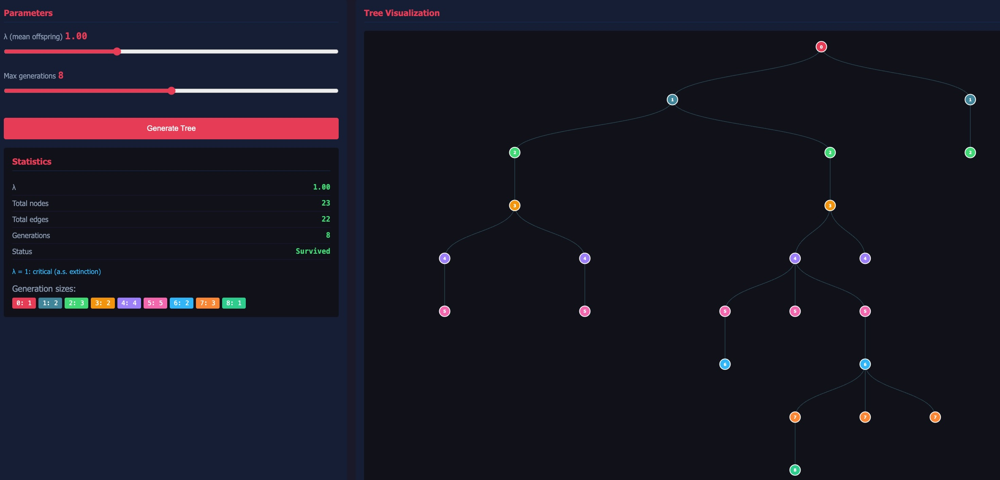
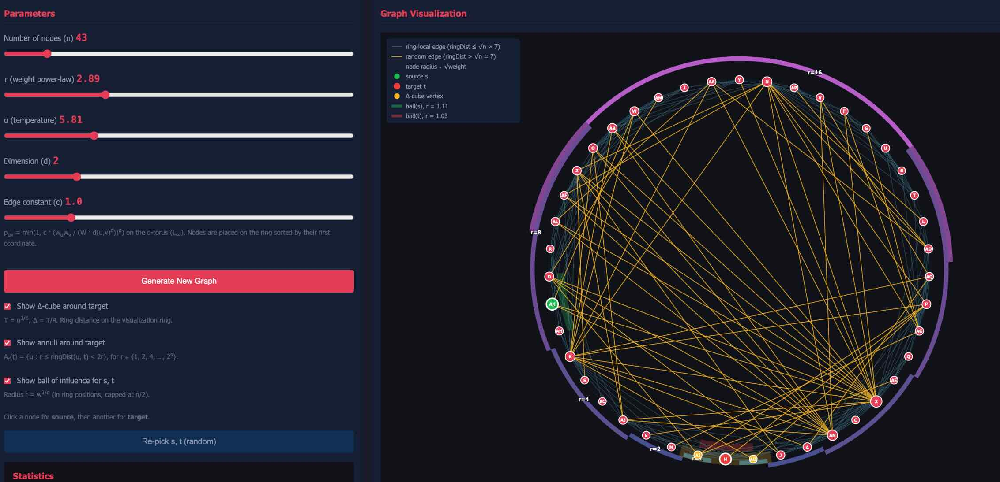

# CNM Viz

(unofficial) Interactive visualisations for the **Complex Network Models** course (FS 2026, ETH Zürich).  
The dashboard was vibe-coded, overall there could be errors both in visualisation and in model spec, no guarantee whatsoever.

Sources: 
- [vvz](https://vvz.ethz.ch/Vorlesungsverzeichnis/lerneinheit.view?lerneinheitId=199804&semkez=2026S&ansicht=LEHRVERANSTALTUNGEN) 
- [course's page](https://cadmo.ethz.ch/education/lectures/FS26/cnm/index.html)
- [lecture's notes](https://as.inf.ethz.ch/people/members/lenglerj/CompNetScript.pdf)

## Few screenshots

**Galton–Watson**



**GIRG**




## Models / tabs

- **Erdős–Rényi** — G(n, p) sampler with component stats.
- **Traversal** — BFS / BBFS / DFS / BDFS on built-in and custom graphs.
- **Galton–Watson** — branching process with Poisson offspring.
- **Chung–Lu** — power-law weighted ER variant.
- **Barabási–Albert** — preferential attachment / scale-free network.
- **Watts–Strogatz** — small-world model with Δ-cube highlight.
- **Kleinberg** — WS with d^(-r) rewiring; Δ-cube + dyadic annuli.
- **GIRG** — geometric inhomogeneous random graphs on the d-torus.

## Running locally

Requires [uv](https://github.com/astral-sh/uv) (Astral's Python launcher; it
takes care of creating the virtual environment from `pyproject.toml` /
`uv.lock` automatically).

```bash
uv run python server.py            # default port 5733
uv run python server.py -p 8000    # custom port
```

## License

MIT — see [`LICENSE`](LICENSE).
